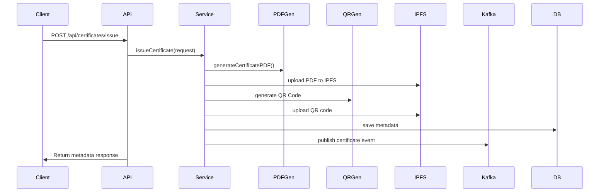

---

# 🔐 IPFS-Powered Certificate Generator with Kafka Events

A **Spring Boot** based certificate generation system that:

* Generates certificate PDFs
* Uploads them to **IPFS via Pinata**
* Generates QR codes linked to the PDF
* Publishes a **Kafka Event** to notify listeners
* Persists metadata in PostgreSQL

> 🎯 Designed for transparency, decentralization, and event-driven systems.

---

## 🚀 Features

* 📄 PDF Certificate Generation
* 🔗 IPFS File Storage via **Pinata**
* 📷 QR Code for Verification
* 📬 Kafka Event Publishing
* 🗃 Metadata Storage in PostgreSQL
* 📡 RESTful API for issuing & verifying certificates

---

## ⚙️ Tech Stack

| Layer        | Tools Used                               |
| ------------ | ---------------------------------------- |
| Backend      | Spring Boot, Spring Web, Spring Data JPA |
| Messaging    | Apache Kafka                             |
| IPFS Storage | Pinata + IPFS                            |
| QR Code      | ZXing                                    |
| PDF          | iText or OpenPDF                         |
| DB           | PostgreSQL                               |
| Build Tool   | Maven                                    |

---

## 🧩 High-Level Architecture (HLD)

```plaintext
             +-----------------------+
             |     Client/API       |
             +----------+------------+
                        |
                        v
         +--------------+--------------+
         |      CertificateController |
         +--------------+--------------+
                        |
                        v
        +---------------+---------------+
        |        CertificateService     |
        +----+------------+-------------+
             |            |        
      +------+      +-----+--------+      
      | PDF Generator | QR Generator |
      +------+      +--------------+      
             |              
      +------+-------------------+             
      |   IPFS Upload (Pinata)   |            
      +-------------+------------+         
                    |                     
          +---------v-----------+        
          |  Kafka Event Sender |        
          +---------------------+         
                    |
                    v
           Kafka Topic: `certificate-events`
```

---

## 🧬 Low-Level Design (LLD)

### 📁 Layers

* **Controller**: Handles incoming API requests
* **Service**: Core business logic including:

  * PDF generation
  * QR code generation
  * Upload to IPFS
  * Kafka event publishing
* **Repository**: Interacts with PostgreSQL to save metadata

### 📦 Modules

| Module                | Responsibility                             |
| --------------------- | ------------------------------------------ |
| `CertificateService`  | Orchestrates full certificate issuing flow |
| `PDFGeneratorService` | Creates PDF from request                   |
| `QRCodeService`       | Generates QR codes from URLs               |
| `PinataService`       | Uploads files to IPFS via Pinata API       |
| `KafkaProducer`       | Publishes certificate events to Kafka      |
| `CertificateRepo`     | Saves metadata in PostgreSQL               |

---

## 🖼️ Flow Diagram



---

## 🔧 API Endpoints

| Method | Endpoint                        | Description              |
| ------ | ------------------------------- | ------------------------ |
| POST   | `/api/certificates/issue`       | Issue a new certificate  |
| GET    | `/api/certificates/verify/{id}` | Verify certificate by ID |

---

## 📝 Sample Response

```json
{
  "id": 1,
  "name": "Karan Sahani",
  "course": "Spring Boot & Kafka",
  "issuedBy": "CodeWithKaran Academy",
  "issueDate": "2025-07-14",
  "ipfsUrl": "https://ipfs.io/ipfs/QmWFHU4gWNV7eUA2J9t1545grchV7rn8vgyCqeaLTnqpfz",
  "qrCodeUrl": "https://ipfs.io/ipfs/QmboSk8mXAByVrS1gvzuvP9YsigjNrFQ7CemgRYPiWa7wg",
  "issuedAt": "2025-07-15T00:05:58.054056"
}
```

* 📄 [View PDF](https://ipfs.io/ipfs/QmWFHU4gWNV7eUA2J9t1545grchV7rn8vgyCqeaLTnqpfz)
* 📷 [View QR Code](https://ipfs.io/ipfs/QmboSk8mXAByVrS1gvzuvP9YsigjNrFQ7CemgRYPiWa7wg)

---

## 📦 Kafka Event

```json
{
  "certificateId": "random-uuid",
  "name": "Karan Sahani",
  "course": "Spring Boot & Kafka",
  "ipfsUrl": "...",
  "qrCodeUrl": "..."
}
```

---

## 📁 Repository Name Suggestion

> **`ipfs-pinata-kafka-certificate-generator`**

This clearly highlights all major tech used.

---

## 📤 Deployment Instructions

1. Clone the repo
2. Set environment variables or update `application.properties`:

```properties
spring.datasource.url=jdbc:postgresql://localhost:5432/certificate_db
spring.datasource.username=${USRENAME}
spring.datasource.password=${PASSWORD}

pinata.api.key=your_pinata_api_key
pinata.secret.key=your_pinata_secret_key

spring.kafka.bootstrap-servers=localhost:9092
```

3. Run Kafka, PostgreSQL, then:

```bash
./mvnw clean install
./mvnw spring-boot:run
```

---

## 🧠 Author

**Karan Sahani**
[GitHub](https://github.com/karansahani78) • [LinkedIn](https://www.linkedin.com/in/karan-sahani-70a0ba2b1/)
Java Spring Boot Backend Developer | Blockchain Enthusiast

---

Would you like me to also generate a **visual PNG architecture diagram** you can upload to the repo?
